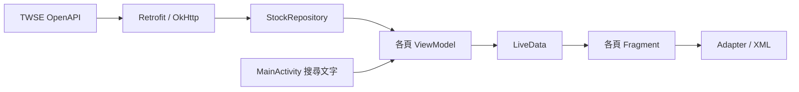

# StockAPIDemo

串接臺灣證券交易所 OpenAPI 的 Android 股票查詢 App，以 **Kotlin、XML DataBinding 與 MVVM** 實作估值指標、收盤均價及每日成交三個頁面。

專案著重於固定表頭對齊、可展開資料列、股票即時篩選，以及清楚的畫面與資料處理分工。

## 功能

- 自訂橫向 RecyclerView 分頁列，搭配 ViewPager2 切換三個 Fragment。
- 估值指標：股票代號、名稱與本益比，展開查看殖利率、股價淨值比。
- 收盤均價：直接顯示代號、名稱、收盤價與月平均價。
- 每日成交：收盤價與漲跌價差，展開查看開高低價、成交股數、金額與筆數。
- 固定欄位表頭與資料列共用欄位 layout，保持對齊。
- AppBarLayout 隨列表滑動收合標題，保留分頁列。
- 右下角搜尋按鈕向左展開成輸入泡泡；輸入停頓 300ms 後依名稱或代號部分比對，切頁保留條件。
- 載入提示、錯誤重試、空資料與查無搜尋結果提示。
- 深淺色資源；搜尋文字與開關狀態在畫面重建時保存。

## 技術與架構

| 技術／套件 | 用途 |
| --- | --- |
| Kotlin、XML、DataBinding | 畫面開發與 View 綁定，透過 Binding.inflate 建立畫面 |
| MVVM、ViewModel、LiveData | 分離畫面操作與資料處理，依生命週期觀察資料 |
| RxJava 3、RxAndroid | Flowable API 請求、執行緒切換、搜尋延遲與訂閱管理 |
| Retrofit 2.11.0、OkHttp 4.12.0、Gson | HTTP 請求、逾時設定、Debug 日誌與 JSON 解析 |
| RecyclerView、BRVAH 4.1.4 | 使用官方 DataBindingHolder 綁定列表資料 |
| ViewPager2 | 承載三個獨立 Fragment |
| Material Components、CoordinatorLayout | AppBarLayout 頂部滑動收合 |
| ExpandableLayout 2.9.2 | 資料列展開與收合動畫 |
| JUnit 4 | 搜尋單元測試與 API 整合測試 |

三頁各自使用一個 ViewModel；共用搜尋條件由 MainActivity 的 LiveData 傳給各頁，再由各頁 ViewModel 篩選自己的資料。



```text
MainActivity                 分頁、共用搜尋文字與系統列處理
view/                        三個 Fragment、搜尋泡泡 UI 與動畫
viewmodel/                   各頁原始資料、搜尋、載入與錯誤處理
repository/                  三支 API 的資料入口
network/                     Retrofit、OkHttp 與 TwseApi
model/DataClasses.kt         API 資料與分頁 data class
model/StockSearch.kt         共用名稱／代號篩選函式
adapter/                     BRVAH 資料綁定
```

Repository 經 RxJava 將資料傳入 ViewModel，以 MutableLiveData 更新，對外提供 LiveData 供 Fragment 觀察。網路請求在 IO 執行，畫面更新切回主執行緒，ViewModel 清除時釋放訂閱。

## 資料處理設計

- **保留來源格式**：API 欄位以可空字串接收，避免股票代號的前導零消失；顯示階段再格式化數值。
- **區分缺值與零**：空白或缺漏數據顯示「—」，不將缺失的本益比等數值視為 0。
- **成交數值格式化**：使用 BigDecimal 處理成交數值與千分位；漲跌以正負號及顏色呈現。
- **保留原始資料**：ViewModel 分開保存原始清單與篩選結果，連續搜尋不會逐次縮減原始資料。
- **本機搜尋**：名稱或代號任一包含關鍵字即可符合，忽略前後空白與英文字母大小寫。輸入停頓 300ms 後更新，清空時立即恢復。
- **載入期間保留條件**：API 回傳後套用目前關鍵字；查無結果時仍顯示原始資料日期。
- **避免重複請求**：同一 ViewModel 已載入成功或正在請求時，loadIfNeeded 不再發出請求；失敗後可重試。
- **生命週期清理**：Fragment 銷毀 View 時清除 Binding 與 Adapter，ViewModel 清除時釋放 RxJava 訂閱。

## 資料來源

[臺灣證券交易所 OpenAPI](https://openapi.twse.com.tw/)，Base URL：`https://openapi.twse.com.tw/v1/`。

| API | 畫面 |
| --- | --- |
| `/exchangeReport/BWIBBU_ALL` | 估值指標 |
| `/exchangeReport/STOCK_DAY_AVG_ALL` | 收盤均價 |
| `/exchangeReport/STOCK_DAY_ALL` | 每日成交 |

畫面日期依 API 回傳資料顯示，並非即時報價。

## 開啟與建置

```bash
git clone https://github.com/mkjihu/StockAPIDemo.git
cd StockAPIDemo
```

1. 以支援本專案 AGP 9.3.2 的 Android Studio 開啟專案根目錄。
2. 安裝 Android SDK 36，Gradle JDK 設為 JDK 21；可使用相容的 Android Studio 內建 JBR。
3. 由 Android Studio 建立本機 `local.properties`，完成 Gradle Sync。
4. 選取 `app`，在 Android 7.0（API 24）以上手機或模擬器執行。

專案使用 Gradle Wrapper 9.5.0，compileSdk / targetSdk 為 36。首次同步需要網路下載依賴。本機 SDK 路徑、IDE 快取與 build 產物不納入版本控制。

Windows PowerShell（先設定有效的 JAVA_HOME）：

```powershell
.\gradlew.bat :app:assembleDebug :app:lintDebug
```

APK 輸出：`app/build/outputs/apk/debug/app-debug.apk`。

## 測試

不依賴網路的搜尋單元測試，涵蓋名稱、代號、前導零、大小寫、空白、缺值、查無結果與連續搜尋：

```powershell
.\gradlew.bat :app:testDebugUnitTest --tests '*StockSearchTest'
```

實際 API 整合測試會呼叫三支 API，檢查回傳非空與 Code / Name / Date，並在 Run 視窗或 Gradle console 輸出筆數與前三筆資料，標記為 `[TwseApiTest]`。此測試需要網路，會受外部服務狀態影響。

```powershell
.\gradlew.bat :app:testDebugUnitTest --tests '*TwseApiLiveTest' -PtwseLiveTest=true --console=plain
```

測試報告：`app/build/reports/tests/testDebugUnitTest/index.html`。

## 驗證範圍與待完成事項

- 已通過 Debug 建置、Lint 檢查與 6 項搜尋單元測試；Lint 通過不代表沒有警告。
- API 整合測試可依上方指令獨立執行，測試輸出位於 Run 視窗，不是手機 Logcat。
- 已加入深淺色資源與搜尋狀態保存；搜尋動畫、鍵盤互動及旋轉後操作仍待實機確認。
- ExampleInstrumentedTest 為 Android 專案範本測試，目前尚無完整操作流程的自動化 UI 測試。
- YouTube 操作影片連結待補。
